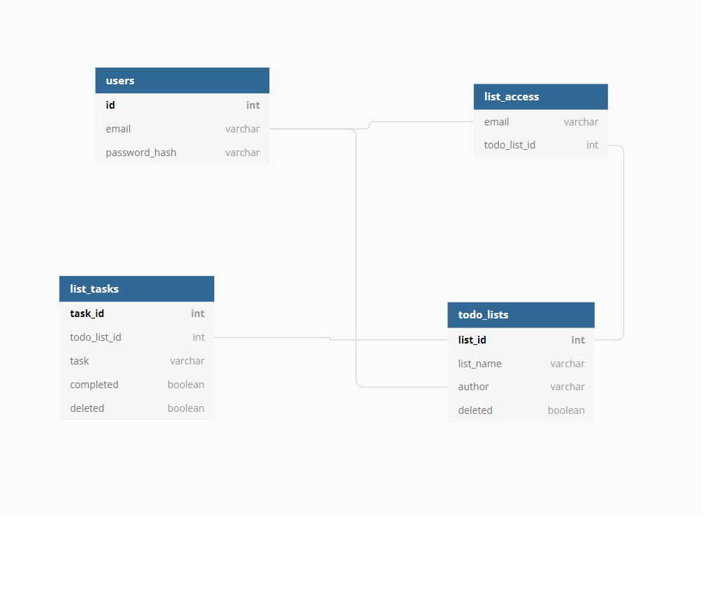
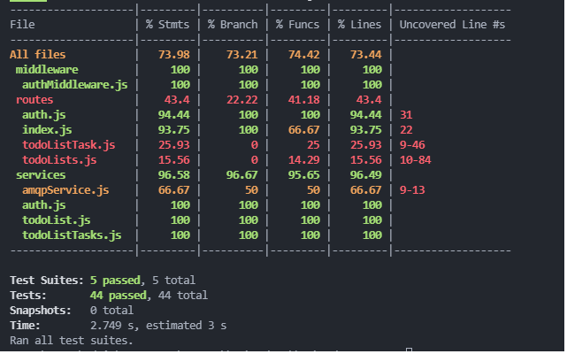

# Fundamentals in Backend Development Capstone Project

The objective of this project is to create a TODO-list CRUD API with several endpoints. The endpoints are defined as follows:

#### Public Endpoints

- POST /register => a public registration endpoint that accepts an email and password and saves these new users in the DB. There will not be 2 users with the same email.
- POST /login => a login endpoint that checks for the validity of the email and password and returns a JSON Web token (saved as a cookie)

#### Authenticated Endpoints

##### Endpoints relating to the entire TODO-list

- POST /todo => a create endpoint that is only accessible by the user who created the list/anyone who is authorised to do so
- GET /todo => a read endpoint that returns all the TODO-lists accessible/created by the current user
- GET /todo/:id => a read endpoint that returns the specific TODO-list along with all its corresponding items based on the current user
- PUT /todo/:id => an update endpoint that updates the TODO-list based on the updated information provided by the current user
- DELETE /todo/:id => a delete endpoint that soft deletes a specific TODO-list. 
- POST /todo/access => an endpoint to allow users to access and edit the TODO-list by adding their emails.

##### Endpoints relating to a specific item in the TODO-list
- POST /todo/:id => a create endpoint accessible by the users/editors to create a TODO-list item. Only one task is processed and added at any given time
- PUT /todo/:id/:item => an update endpoint allowing users/editors to update a specific TODO-list item
- DELETE /todo/:id/:item => a delete endpoint to delete a specific TODO-list item

All endpoints will return a proper JSON response with a given status code, user email and the data and/or error (if any)

##### Database design
PostgresDB is the database of choice in this project. It is structured in the following manner:

- The users table will be responsible for storing user specific information such as the email and password.
- The todo_lists table will store the high level overview of the todo-lists such as the name and the id
- The list_tasks table will store the detailed description of the individual tasks 
- The list_access table will store the access permissions of each todo list. Every email will recorded in this table will be paired with a corresponding todo list id, this allows for checking of user permissions

##### Test coverage
The test coverage (as covered by jest) is as follows:

- All test files are stored under the test folder
- The current code coverage for the tests can be further improved